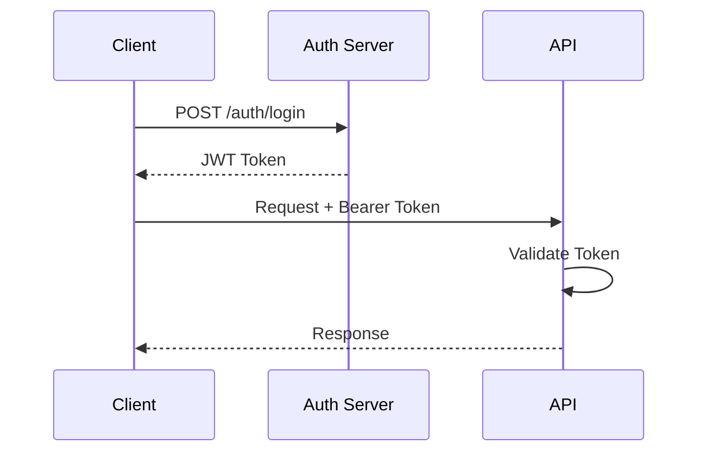

# SkyGuard Analytics - API Documentation

## Table of Contents
1. [API Overview](#api-overview)
2. [Authentication](#authentication)
3. [Rate Limiting](#rate-limiting)
4. [Error Handling](#error-handling)
5. [Weather Nowcasting Endpoints](#weather-nowcasting-endpoints)
6. [Impact Analysis Endpoints](#impact-analysis-endpoints)
7. [Risk Assessment Endpoints](#risk-assessment-endpoints)
8. [Scenario Simulation Endpoints](#scenario-simulation-endpoints)
9. [WebSocket Connections](#websocket-connections)
10. [Response Formats](#response-formats)
11. [Code Examples](#code-examples)

## API Overview

### Base URLs
- **Production**: `https://api.skyguard-analytics.com`
- **Development**: `http://localhost:8000`
- **Current Version**: `v1`
- **Full Path Pattern**: `{base_url}/api/v1/{endpoint}`

### Request/Response Format
- **Content-Type**: `application/json`
- **Accept**: `application/json`
- **Encoding**: `UTF-8`

### HTTP Methods
- `GET`: Retrieve data
- `POST`: Create or process data
- `PUT`: Update existing data
- `DELETE`: Remove data
- `OPTIONS`: CORS preflight

### Status Codes
| Code | Description |
|------|-------------|
| 200 | Success |
| 201 | Created |
| 204 | No Content |
| 400 | Bad Request |
| 401 | Unauthorized |
| 403 | Forbidden |
| 404 | Not Found |
| 429 | Too Many Requests |
| 500 | Internal Server Error |
| 503 | Service Unavailable |

## Authentication

Currently, the API is open for development. Production will implement:

```http
Authorization: Bearer {token}
```

### Future Authentication Flow


## Rate Limiting

### Limits
- **Default**: 100 requests per minute
- **Authenticated**: 1000 requests per minute
- **Enterprise**: Custom limits

### Headers
```http
X-RateLimit-Limit: 100
X-RateLimit-Remaining: 95
X-RateLimit-Reset: 1609459200
```

## Error Handling

### Error Response Format
```json
{
    "success": false,
    "error_code": "E001",
    "error_message": "Model not loaded",
    "details": {
        "model": "weather_nowcasting",
        "status": "loading"
    },
    "timestamp": "2025-01-07T12:00:00Z"
}
```

### Common Error Codes
| Code | Description | Resolution |
|------|-------------|------------|
| E001 | Model not loaded | Wait for model initialization |
| E002 | Invalid input data | Check request format |
| E003 | Rate limit exceeded | Reduce request frequency |
| E004 | Service unavailable | Check system status |
| E005 | Authentication failed | Verify credentials |

## Weather Nowcasting Endpoints

### 1. Generate Weather Prediction
**Endpoint**: `POST /api/v1/nowcasting/predict`

**Description**: Generate 6-frame precipitation predictions based on radar data

**Request Body**:
```json
{
    "site_id": "KAMX",
    "use_latest_data": true,
    "hours_back": 12,
    "custom_radar_data": null
}
```

**Parameters**:
| Field | Type | Required | Description |
|-------|------|----------|-------------|
| site_id | string | Yes | Radar site ID (KAMX or KATX) |
| use_latest_data | boolean | No | Use latest available data (default: true) |
| hours_back | integer | No | Hours to look back (1-48, default: 12) |
| custom_radar_data | array | No | Custom radar input (10,64,64,1) |

**Response**:
```json
{
    "success": true,
    "site_info": {
        "site_id": "KAMX",
        "name": "Miami, FL",
        "location": "Miami NEXRAD Station",
        "coordinates": [25.6112, -80.4128],
        "description": "Primary radar for South Florida"
    },
    "prediction_frames": [
        [[[]]]
    ],
    "input_metadata": {
        "data_source": "nexrad_gcp",
        "files_used": 20,
        "processing_metadata": {}
    },
    "ml_model_metadata": {
        "model_name": "MinimalConvLSTM",
        "version": "1.0",
        "accuracy": 0.9998
    },
    "processing_time_ms": 187.5,
    "prediction_timestamp": "2025-01-07T12:00:00Z",
    "frame_times": [
        "2025-01-07T12:10:00",
        "2025-01-07T12:20:00",
        "2025-01-07T12:30:00",
        "2025-01-07T12:40:00",
        "2025-01-07T12:50:00",
        "2025-01-07T13:00:00"
    ]
}
```

### 2. Batch Weather Nowcast
**Endpoint**: `POST /api/v1/nowcasting/batch`

**Description**: Generate predictions for multiple radar sites

**Request Body**:
```json
{
    "site_ids": ["KAMX", "KATX"],
    "hours_back": 12
}
```

**Response**:
```json
{
    "success": true,
    "predictions": {
        "KAMX": { /* prediction response */ },
        "KATX": { /* prediction response */ }
    },
    "total_sites": 2,
    "successful_sites": 2,
    "failed_sites": 0,
    "total_processing_time_ms": 385.2,
    "batch_timestamp": "2025-01-07T12:00:00Z"
}
```

### 3. Get Current Radar Conditions
**Endpoint**: `GET /api/v1/nowcasting/current-conditions/{site_id}`

**Description**: Get current radar conditions and data availability

**Response**:
```json
{
    "site_info": {
        "site_id": "KAMX",
        "name": "Miami, FL",
        "location": "Miami NEXRAD Station",
        "coordinates": [25.6112, -80.4128]
    },
    "latest_data_time": "2025-01-07T11:55:00Z",
    "data_freshness_hours": 0.083,
    "available_frames": 120,
    "data_quality": "excellent",
    "coverage_area_km": 150,
    "last_updated": "2025-01-07T12:00:00Z"
}
```

### 4. Get Raw Radar Data
**Endpoint**: `GET /api/v1/nowcasting/radar-data/{site_id}`

**Description**: Get raw radar data arrays with geographic coordinates

**Query Parameters**:
| Parameter | Type | Default | Description |
|-----------|------|---------|-------------|
| hours_back | int | 6 | Hours of historical data |
| max_frames | int | 20 | Maximum frames to return |
| include_processing_metadata | bool | false | Include processing details |

**Response**:
```json
{
    "success": true,
    "site_info": { /* site details */ },
    "frames": [
        {
            "timestamp": "2025-01-07T12:00:00Z",
            "data": [[/* 64x64 array */]],
            "coordinates": {
                "bounds": [-81.5, -79.3, 24.7, 26.5],
                "center": [25.6112, -80.4128],
                "resolution_deg": 0.028125,
                "resolution_km": 3.125,
                "projection": "PlateCarree",
                "range_km": 150
            },
            "intensity_range": [0.0, 75.0],
            "data_quality": "good"
        }
    ],
    "total_frames": 20,
    "time_range": {
        "start": "2025-01-07T06:00:00Z",
        "end": "2025-01-07T12:00:00Z"
    },
    "processing_time_ms": 245.8
}
```

### 5. Get Multi-Site Radar Data
**Endpoint**: `GET /api/v1/nowcasting/radar-data/multi-site`

**Description**: Get radar data from multiple sites for composite visualization

**Query Parameters**:
| Parameter | Type | Required | Description |
|-----------|------|----------|-------------|
| site_ids | string | Yes | Comma-separated site IDs |
| hours_back | int | No | Hours of data (default: 6) |
| max_frames_per_site | int | No | Frames per site (default: 10) |

### 6. Get Radar Visualization
**Endpoint**: `GET /api/v1/nowcasting/visualization/{site_id}`

**Description**: Generate NWS-style radar visualization PNG

**Response**: Binary PNG image

### 7. Get Supported Sites
**Endpoint**: `GET /api/v1/nowcasting/sites`

**Response**:
```json
[
    {
        "site_id": "KAMX",
        "name": "Miami, FL",
        "location": "Miami NEXRAD Station",
        "coordinates": [25.6112, -80.4128],
        "description": "Primary radar for South Florida"
    },
    {
        "site_id": "KATX",
        "name": "Seattle, WA",
        "location": "Seattle/Tacoma NEXRAD",
        "coordinates": [48.1945, -122.4958],
        "description": "Covers Puget Sound region"
    }
]
```

## Impact Analysis Endpoints

### 1. Predict Property Damage
**Endpoint**: `POST /api/v1/impact/property-damage`

**Description**: Predict property damage from weather events

**Request Body**:
```json
{
    "event_type": "hurricane",
    "state": "FL",
    "magnitude": 135,
    "duration_hours": 8
}
```

**Parameters**:
| Field | Type | Required | Description |
|-------|------|----------|-------------|
| event_type | string | Yes | Type of weather event |
| state | string | Yes | US state code |
| magnitude | float | Yes | Wind speed in mph |
| duration_hours | float | Yes | Event duration |

**Response**:
```json
{
    "predicted_damage": 5250000000,
    "prediction_range": {
        "low_estimate": 3500000000,
        "high_estimate": 7000000000
    },
    "confidence_score": 0.82,
    "damage_category": "catastrophic",
    "influential_factors": [
        {
            "factor": "magnitude",
            "correlation": 0.89,
            "importance": 0.42,
            "value": 135
        },
        {
            "factor": "duration_hours",
            "correlation": 0.67,
            "importance": 0.28,
            "value": 8
        }
    ]
}
```

### 2. Predict Casualty Risk
**Endpoint**: `POST /api/v1/impact/casualty-risk`

**Description**: Assess probability of casualties

**Request Body**:
```json
{
    "event_type": "tornado",
    "state": "OK",
    "magnitude": 165,
    "tor_f_scale": "EF4"
}
```

**Response**:
```json
{
    "casualty_risk_score": 0.73,
    "risk_category": "high",
    "probability": {
        "no_casualties": 0.27,
        "minor_injuries": 0.45,
        "major_injuries": 0.20,
        "fatalities": 0.08
    },
    "population_risk_factors": {
        "population_density": 0.65,
        "vulnerable_population": 0.42,
        "infrastructure_resilience": 0.71
    }
}
```

### 3. Predict Severity
**Endpoint**: `POST /api/v1/impact/severity`

**Description**: Classify event severity based on impact metrics

**Request Body**:
```json
{
    "event_type": "flood",
    "state": "TX",
    "magnitude": 45,
    "property_damage": 10000000,
    "injuries": 25,
    "deaths": 2
}
```

**Response**:
```json
{
    "severity_class": "major",
    "severity_score": 0.78,
    "confidence_score": 0.91,
    "description": "Major impact event with significant property damage and casualties",
    "impact_factors": {
        "economic_impact": "severe",
        "human_impact": "moderate",
        "infrastructure_impact": "major"
    }
}
```

### 4. Comprehensive Assessment
**Endpoint**: `POST /api/v1/impact/comprehensive-assessment`

**Description**: Complete impact analysis using all models

**Request Body**:
```json
{
    "event_type": "hurricane",
    "state": "FL",
    "magnitude": 150,
    "duration_hours": 12
}
```

**Response**:
```json
{
    "property_damage": {
        "predicted_damage": 8500000000,
        "prediction_range": {
            "low_estimate": 6000000000,
            "high_estimate": 11000000000
        },
        "confidence_score": 0.79,
        "damage_category": "catastrophic"
    },
    "casualty_risk": {
        "risk_score": 0.81,
        "risk_category": "very_high",
        "probability": {
            "no_casualties": 0.19,
            "minor_injuries": 0.42,
            "major_injuries": 0.28,
            "fatalities": 0.11
        }
    },
    "severity_assessment": {
        "severity_class": "catastrophic",
        "severity_score": 0.92,
        "confidence_score": 0.88,
        "description": "Catastrophic event with extreme impacts"
    },
    "event_params": {
        "event_type": "hurricane",
        "state": "FL",
        "magnitude": 150,
        "duration_hours": 12
    }
}
```

## Risk Assessment Endpoints

### 1. Get State Risk
**Endpoint**: `GET /api/v1/risk/state/{state_code}`

**Description**: Get risk assessment for a specific state

**Response**:
```json
{
    "state_code": "FL",
    "overall_risk_score": 0.78,
    "risk_category": "high",
    "event_risks": {
        "hurricane": 0.92,
        "tornado": 0.45,
        "flood": 0.73,
        "thunderstorm_wind": 0.68
    },
    "historical_statistics": {
        "total_events": 15234,
        "avg_annual_damage": 2500000000,
        "avg_annual_casualties": 125
    },
    "vulnerability_factors": {
        "coastal_exposure": 0.95,
        "population_density": 0.62,
        "infrastructure_age": 0.48
    }
}
```

### 2. Multi-State Risk Comparison
**Endpoint**: `POST /api/v1/risk/multi-state`

**Description**: Compare risk across multiple states

**Request Body**:
```json
{
    "state_codes": ["FL", "TX", "CA", "NY"]
}
```

**Response**:
```json
{
    "comparison": [
        {
            "state_code": "FL",
            "overall_risk_score": 0.78,
            "rank": 1,
            "primary_threats": ["hurricane", "flood"]
        },
        {
            "state_code": "TX",
            "overall_risk_score": 0.72,
            "rank": 2,
            "primary_threats": ["tornado", "flood"]
        }
    ],
    "highest_risk": "FL",
    "lowest_risk": "NY",
    "comparison_metrics": {
        "methodology": "weighted_composite",
        "factors_considered": 12
    }
}
```

### 3. Get Risk Rankings
**Endpoint**: `GET /api/v1/risk/rankings`

**Query Parameters**:
| Parameter | Type | Default | Description |
|-----------|------|---------|-------------|
| limit | int | 10 | Number of states to return |
| ascending | bool | false | Sort order |

**Response**:
```json
{
    "rankings": [
        {
            "rank": 1,
            "state_code": "FL",
            "risk_score": 0.78,
            "primary_threat": "hurricane"
        },
        {
            "rank": 2,
            "state_code": "TX",
            "risk_score": 0.72,
            "primary_threat": "tornado"
        }
    ],
    "total_states": 52,
    "assessment_date": "2025-01-07"
}
```

### 4. Event Type Risk Analysis
**Endpoint**: `GET /api/v1/risk/event-type/{event_type}`

**Description**: Analyze risk for specific event type across all states

**Response**:
```json
{
    "event_type": "hurricane",
    "high_risk_states": ["FL", "TX", "LA", "NC", "SC"],
    "risk_distribution": {
        "very_high": 5,
        "high": 8,
        "moderate": 12,
        "low": 15,
        "very_low": 12
    },
    "seasonal_patterns": {
        "peak_months": ["August", "September", "October"],
        "off_season": ["December", "January", "February"]
    }
}
```

### 5. Risk Summary
**Endpoint**: `GET /api/v1/risk/summary`

**Description**: Get overall risk summary across all states and event types

**Response**:
```json
{
    "national_risk_level": "moderate",
    "total_annual_damage": 125000000000,
    "total_annual_casualties": 3500,
    "highest_risk_regions": [
        "Southeast",
        "Gulf Coast",
        "Midwest"
    ],
    "trending": {
        "risk_trend": "increasing",
        "rate_of_change": 0.035,
        "primary_drivers": ["climate_change", "urbanization"]
    }
}
```

## Scenario Simulation Endpoints

### 1. Run Scenario Simulation
**Endpoint**: `POST /api/v1/simulation/scenario`

**Description**: Simulate weather scenario with modifications

**Request Body**:
```json
{
    "base_event": {
        "event_type": "hurricane",
        "state": "FL",
        "magnitude": 120,
        "duration_hours": 6
    },
    "modifications": [
        {
            "parameter": "magnitude",
            "modification_type": "add",
            "value": 30
        },
        {
            "parameter": "duration_hours",
            "modification_type": "multiply",
            "value": 1.5
        }
    ],
    "include_uncertainty": true
}
```

**Response**:
```json
{
    "scenario_id": "sim_12345",
    "base_impact": {
        "property_damage": 2500000000,
        "casualty_risk": 0.45
    },
    "modified_impact": {
        "property_damage": 5800000000,
        "casualty_risk": 0.72
    },
    "change_analysis": {
        "damage_increase_pct": 132,
        "risk_increase_pct": 60,
        "severity_change": "moderate_to_major"
    },
    "uncertainty_bounds": {
        "damage_range": [4500000000, 7100000000],
        "risk_range": [0.65, 0.79]
    }
}
```

### 2. Batch Simulation
**Endpoint**: `POST /api/v1/simulation/batch`

**Description**: Run multiple scenario variations

**Request Body**:
```json
{
    "base_event": {
        "event_type": "tornado",
        "state": "OK",
        "magnitude": 140
    },
    "scenario_sets": [
        [
            {"parameter": "magnitude", "modification_type": "set", "value": 120}
        ],
        [
            {"parameter": "magnitude", "modification_type": "set", "value": 160}
        ],
        [
            {"parameter": "magnitude", "modification_type": "set", "value": 200}
        ]
    ]
}
```

### 3. Sensitivity Analysis
**Endpoint**: `POST /api/v1/simulation/sensitivity`

**Description**: Analyze parameter sensitivity

**Request Body**:
```json
{
    "base_event": {
        "event_type": "flood",
        "state": "TX",
        "magnitude": 50,
        "duration_hours": 24
    },
    "parameters": ["magnitude", "duration_hours"],
    "variation_range": 0.2
}
```

**Response**:
```json
{
    "sensitivity_results": {
        "magnitude": {
            "impact_correlation": 0.89,
            "elasticity": 1.45,
            "critical_threshold": 65
        },
        "duration_hours": {
            "impact_correlation": 0.67,
            "elasticity": 0.92,
            "critical_threshold": 36
        }
    },
    "most_sensitive": "magnitude",
    "recommendations": [
        "Magnitude has highest impact on outcomes",
        "Duration shows diminishing returns after 36 hours"
    ]
}
```

## WebSocket Connections

### Real-time Weather Updates
**Endpoint**: `ws://api.skyguard-analytics.com/ws/weather`

**Connection**:
```javascript
const ws = new WebSocket('ws://api.skyguard-analytics.com/ws/weather');

ws.onopen = () => {
    ws.send(JSON.stringify({
        action: 'subscribe',
        sites: ['KAMX', 'KATX']
    }));
};

ws.onmessage = (event) => {
    const data = JSON.parse(event.data);
    console.log('Weather update:', data);
};
```

**Message Format**:
```json
{
    "type": "radar_update",
    "site_id": "KAMX",
    "timestamp": "2025-01-07T12:00:00Z",
    "data": {
        "reflectivity": [[/* array */]],
        "velocity": [[/* array */]]
    }
}
```

## Response Formats

### Success Response
```json
{
    "success": true,
    "data": { /* response data */ },
    "metadata": {
        "processing_time_ms": 145.2,
        "api_version": "1.0",
        "timestamp": "2025-01-07T12:00:00Z"
    }
}
```

### Error Response
```json
{
    "success": false,
    "error": {
        "code": "E002",
        "message": "Invalid input data",
        "details": {
            "field": "magnitude",
            "issue": "Value must be positive"
        }
    },
    "timestamp": "2025-01-07T12:00:00Z"
}
```

### Pagination Response
```json
{
    "data": [ /* items */ ],
    "pagination": {
        "page": 1,
        "per_page": 20,
        "total_pages": 5,
        "total_items": 95
    },
    "links": {
        "self": "/api/v1/endpoint?page=1",
        "next": "/api/v1/endpoint?page=2",
        "prev": null,
        "first": "/api/v1/endpoint?page=1",
        "last": "/api/v1/endpoint?page=5"
    }
}
```

## Code Examples

### JavaScript/TypeScript
```typescript
import axios from 'axios';

const API_BASE = 'http://localhost:8000/api/v1';

// Property Damage Prediction
async function predictDamage(event: WeatherEvent) {
    try {
        const response = await axios.post(
            `${API_BASE}/impact/property-damage`,
            {
                event_type: event.type,
                state: event.state,
                magnitude: event.magnitude,
                duration_hours: event.duration
            }
        );
        return response.data;
    } catch (error) {
        console.error('Prediction failed:', error);
        throw error;
    }
}

// Weather Nowcasting
async function getWeatherPrediction(siteId: string) {
    const response = await axios.post(
        `${API_BASE}/nowcasting/predict`,
        {
            site_id: siteId,
            use_latest_data: true,
            hours_back: 12
        }
    );
    return response.data;
}
```

### Python
```python
import requests
import json

API_BASE = "http://localhost:8000/api/v1"

def predict_property_damage(event_type, state, magnitude, duration):
    """Predict property damage from weather event"""
    
    url = f"{API_BASE}/impact/property-damage"
    payload = {
        "event_type": event_type,
        "state": state,
        "magnitude": magnitude,
        "duration_hours": duration
    }
    
    response = requests.post(url, json=payload)
    response.raise_for_status()
    
    return response.json()

def get_weather_nowcast(site_id="KAMX"):
    """Get weather nowcast prediction"""
    
    url = f"{API_BASE}/nowcasting/predict"
    payload = {
        "site_id": site_id,
        "use_latest_data": True,
        "hours_back": 12
    }
    
    response = requests.post(url, json=payload)
    return response.json()

# Example usage
if __name__ == "__main__":
    # Predict hurricane damage
    damage = predict_property_damage(
        event_type="hurricane",
        state="FL",
        magnitude=135,
        duration=8
    )
    print(f"Predicted damage: ${damage['predicted_damage']:,.0f}")
    
    # Get weather prediction
    nowcast = get_weather_nowcast("KAMX")
    print(f"Prediction frames: {len(nowcast['prediction_frames'])}")
```

### cURL Examples
```bash
# Property Damage Prediction
curl -X POST http://localhost:8000/api/v1/impact/property-damage \
  -H "Content-Type: application/json" \
  -d '{
    "event_type": "hurricane",
    "state": "FL",
    "magnitude": 135,
    "duration_hours": 8
  }'

# Weather Nowcasting
curl -X POST http://localhost:8000/api/v1/nowcasting/predict \
  -H "Content-Type: application/json" \
  -d '{
    "site_id": "KAMX",
    "use_latest_data": true,
    "hours_back": 12
  }'

# Get State Risk
curl -X GET http://localhost:8000/api/v1/risk/state/FL

# Run Scenario Simulation
curl -X POST http://localhost:8000/api/v1/simulation/scenario \
  -H "Content-Type: application/json" \
  -d '{
    "base_event": {
      "event_type": "hurricane",
      "state": "FL",
      "magnitude": 120,
      "duration_hours": 6
    },
    "modifications": [
      {
        "parameter": "magnitude",
        "modification_type": "add",
        "value": 30
      }
    ]
  }'
```

### React Hook Example
```typescript
import { useState, useEffect } from 'react';
import { predictPropertyDamage } from '@/lib/api';

export function usePropertyDamage(params: DamageParams) {
    const [data, setData] = useState(null);
    const [loading, setLoading] = useState(false);
    const [error, setError] = useState(null);

    useEffect(() => {
        const fetchDamage = async () => {
            setLoading(true);
            try {
                const result = await predictPropertyDamage(params);
                setData(result.data);
            } catch (err) {
                setError(err);
            } finally {
                setLoading(false);
            }
        };

        if (params.event_type && params.state) {
            fetchDamage();
        }
    }, [params]);

    return { data, loading, error };
}
```

## API Rate Limiting Best Practices

1. **Implement Exponential Backoff**
```javascript
async function fetchWithRetry(url, options, maxRetries = 3) {
    for (let i = 0; i < maxRetries; i++) {
        try {
            const response = await fetch(url, options);
            if (response.status === 429) {
                const retryAfter = response.headers.get('X-RateLimit-Reset');
                const delay = retryAfter ? 
                    (parseInt(retryAfter) - Date.now() / 1000) * 1000 : 
                    Math.pow(2, i) * 1000;
                await new Promise(resolve => setTimeout(resolve, delay));
                continue;
            }
            return response;
        } catch (error) {
            if (i === maxRetries - 1) throw error;
        }
    }
}
```

2. **Batch Requests When Possible**
   - Use batch endpoints for multiple predictions
   - Combine related requests
   - Cache results locally

3. **Monitor Rate Limit Headers**
   - Track remaining requests
   - Plan request timing
   - Implement request queuing

## Appendices

### A. Event Types
```javascript
const EVENT_TYPES = [
    "thunderstorm wind",
    "tornado",
    "hurricane",
    "hail",
    "flash flood",
    "flood",
    "wildfire",
    "winter storm",
    "high wind",
    "excessive heat",
    "drought",
    "lightning",
    "heavy rain",
    "blizzard",
    "ice storm"
];
```

### B. State Codes
All US state codes including territories (AL, AK, AZ, AR, CA, CO, CT, DC, DE, FL, GA, HI, ID, IL, IN, IA, KS, KY, LA, ME, MD, MA, MI, MN, MS, MO, MT, NE, NV, NH, NJ, NM, NY, NC, ND, OH, OK, OR, PA, PR, RI, SC, SD, TN, TX, UT, VT, VA, WA, WV, WI, WY)

### C. Tornado Scales
```javascript
const TORNADO_SCALES = [
    "F0", "F1", "F2", "F3", "F4", "F5",
    "EF0", "EF1", "EF2", "EF3", "EF4", "EF5"
];
```

### D. Modification Types
```javascript
const MODIFICATION_TYPES = ["set", "add", "multiply"];
```

### E. API Versioning
- Current: `v1`
- Format: `/api/v{version}/endpoint`
- Backward compatibility: 6 months minimum
- Deprecation notice: 3 months advance

---

*API Version: 1.0*  
*Last Updated: 2025*  
*Status: Production Ready*