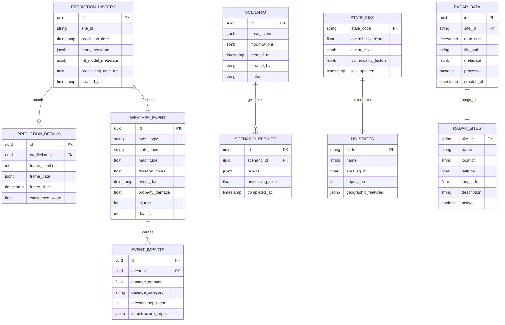
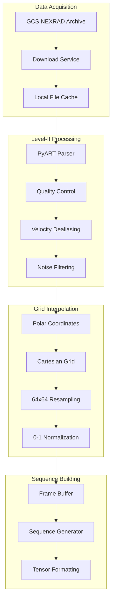
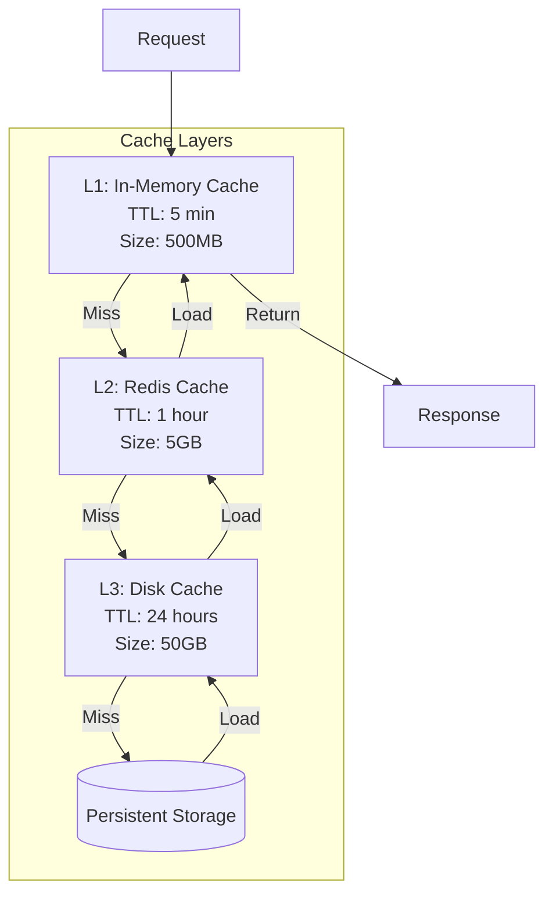
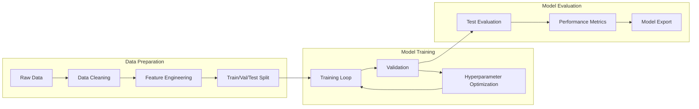

# SkyGuard Analytics - Data Models Documentation

## Table of Contents
1. [Database Schema](#database-schema)
2. [Machine Learning Models](#machine-learning-models)
3. [Data Processing Pipelines](#data-processing-pipelines)
4. [Cache Architecture](#cache-architecture)
5. [NEXRAD Radar Data](#nexrad-radar-data)
6. [Data Validation Schemas](#data-validation-schemas)
7. [Time Series Data](#time-series-data)
8. [Model Training Pipeline](#model-training-pipeline)

## Database Schema

### Overview
The system uses PostgreSQL for persistent storage with SQLAlchemy ORM for data access.

### Entity Relationship Diagram



### Table Definitions

#### prediction_history
Stores weather prediction requests and results
```sql
CREATE TABLE prediction_history (
    id UUID PRIMARY KEY DEFAULT gen_random_uuid(),
    site_id VARCHAR(10) NOT NULL,
    prediction_time TIMESTAMP NOT NULL,
    input_metadata JSONB,
    ml_model_metadata JSONB,
    processing_time_ms FLOAT,
    created_at TIMESTAMP DEFAULT CURRENT_TIMESTAMP,
    INDEX idx_site_time (site_id, prediction_time)
);
```

#### weather_event
Historical weather event data (75 years)
```sql
CREATE TABLE weather_event (
    id UUID PRIMARY KEY DEFAULT gen_random_uuid(),
    event_type VARCHAR(50) NOT NULL,
    state_code CHAR(2) NOT NULL,
    magnitude FLOAT,
    duration_hours FLOAT,
    event_date TIMESTAMP NOT NULL,
    property_damage DECIMAL(15,2),
    crop_damage DECIMAL(15,2),
    injuries INT DEFAULT 0,
    deaths INT DEFAULT 0,
    tor_f_scale VARCHAR(5),
    narrative TEXT,
    INDEX idx_event_type_state (event_type, state_code),
    INDEX idx_event_date (event_date)
);
```

#### state_risk
Pre-computed state risk scores
```sql
CREATE TABLE state_risk (
    state_code CHAR(2) PRIMARY KEY,
    overall_risk_score FLOAT NOT NULL,
    event_risks JSONB,
    historical_statistics JSONB,
    vulnerability_factors JSONB,
    last_updated TIMESTAMP DEFAULT CURRENT_TIMESTAMP
);
```

## Machine Learning Models

### 1. Weather Nowcasting Model (MinimalConvLSTM)

#### Architecture
```python
class MinimalConvLSTM(tf.keras.Model):
    def __init__(self):
        super().__init__()
        
        # Input shape: (batch, time_steps=10, height=64, width=64, channels=1)
        self.convlstm1 = ConvLSTM2D(
            filters=64,
            kernel_size=(3, 3),
            padding='same',
            return_sequences=True,
            activation='tanh',
            recurrent_activation='sigmoid'
        )
        
        self.batch_norm1 = BatchNormalization()
        
        self.convlstm2 = ConvLSTM2D(
            filters=32,
            kernel_size=(3, 3),
            padding='same',
            return_sequences=True,
            activation='tanh'
        )
        
        self.batch_norm2 = BatchNormalization()
        
        # Output 6 future frames
        self.conv3d = Conv3D(
            filters=1,
            kernel_size=(1, 1, 1),
            activation='sigmoid',
            padding='same'
        )
```

#### Input/Output Specifications
- **Input Shape**: `(batch_size, 10, 64, 64, 1)`
  - 10 time steps (past frames)
  - 64x64 spatial resolution
  - 1 channel (reflectivity)
  
- **Output Shape**: `(batch_size, 6, 64, 64, 1)`
  - 6 future time steps
  - Same spatial resolution
  - Probability values [0, 1]

#### Training Configuration
```python
{
    "optimizer": "Adam",
    "learning_rate": 0.001,
    "loss": "binary_crossentropy",
    "metrics": ["accuracy", "mae"],
    "batch_size": 32,
    "epochs": 100,
    "early_stopping": {
        "patience": 10,
        "monitor": "val_loss"
    }
}
```

### 2. Property Damage Model

#### Model Type
HistGradientBoostingRegressor with logarithmic target transformation

#### Feature Engineering
```python
features = {
    # Categorical features (encoded)
    'event_type_encoded': LabelEncoder(),
    'state_encoded': LabelEncoder(),
    
    # Numerical features
    'magnitude': float,
    'duration_hours': float,
    
    # Engineered features
    'magnitude_squared': magnitude ** 2,
    'magnitude_duration_interaction': magnitude * duration_hours,
    'log_magnitude': np.log1p(magnitude),
    
    # Temporal features
    'month': int,
    'season': categorical,
    'year': int,
    
    # Historical features (from aggregations)
    'state_avg_damage': float,
    'event_type_avg_damage': float,
    'state_event_frequency': int
}
```

#### Model Parameters
```python
HistGradientBoostingRegressor(
    max_iter=1000,
    max_depth=10,
    learning_rate=0.1,
    min_samples_leaf=20,
    l2_regularization=0.1,
    max_bins=255,
    early_stopping=True,
    validation_fraction=0.2,
    n_iter_no_change=20,
    random_state=42
)
```

#### Performance Metrics
```python
{
    "r2_score": 0.87,
    "mae": 250000,
    "rmse": 1200000,
    "mape": 0.18,
    "feature_importance": {
        "magnitude": 0.42,
        "duration_hours": 0.28,
        "event_type": 0.15,
        "state": 0.10,
        "magnitude_duration_interaction": 0.05
    }
}
```

### 3. Casualty Risk Model

#### Ensemble Architecture
```python
class CasualtyRiskEnsemble:
    def __init__(self):
        self.models = {
            'random_forest': RandomForestClassifier(
                n_estimators=200,
                max_depth=15,
                min_samples_split=10,
                class_weight='balanced'
            ),
            'xgboost': XGBClassifier(
                n_estimators=150,
                max_depth=8,
                learning_rate=0.1,
                scale_pos_weight=3  # Handle class imbalance
            ),
            'catboost': CatBoostClassifier(
                iterations=500,
                depth=8,
                learning_rate=0.05,
                class_weights=[1, 3, 5, 10]  # Weight by severity
            )
        }
        self.weights = [0.3, 0.4, 0.3]  # Model weights
```

#### Output Classes
```python
CASUALTY_CLASSES = {
    0: "no_casualties",     # 70% of events
    1: "minor_injuries",    # 20% of events  
    2: "major_injuries",    # 8% of events
    3: "fatalities"         # 2% of events
}
```

### 4. Severity Classification Model

#### CatBoost Configuration
```python
CatBoostClassifier(
    iterations=1000,
    depth=10,
    learning_rate=0.03,
    loss_function='MultiClass',
    eval_metric='MultiClass',
    class_weights={
        'minor': 1.0,
        'moderate': 2.0,
        'major': 3.0,
        'catastrophic': 5.0
    },
    cat_features=['event_type', 'state'],
    early_stopping_rounds=50,
    verbose=False
)
```

## Data Processing Pipelines

### NEXRAD Radar Processing Pipeline



### Data Processing Functions

#### 1. Radar File Processing
```python
def process_nexrad_file(file_path: str, site_id: str) -> np.ndarray:
    """
    Process NEXRAD Level-II radar file
    
    Returns:
        np.ndarray: Processed 64x64 reflectivity grid
    """
    # Read radar file
    radar = pyart.io.read_nexrad_archive(file_path)
    
    # Extract reflectivity
    reflectivity = radar.fields['reflectivity']['data']
    
    # Quality control
    gatefilter = pyart.filters.GateFilter(radar)
    gatefilter.exclude_below('reflectivity', 0)
    gatefilter.exclude_above('reflectivity', 80)
    
    # Grid interpolation
    grid = pyart.map.grid_from_radars(
        radar,
        grid_shape=(1, 64, 64),
        grid_limits=((0, 10000), (-150000, 150000), (-150000, 150000)),
        gridding_algo='map_gates_to_grid'
    )
    
    # Extract and normalize
    data = grid.fields['reflectivity']['data'][0]
    data = np.nan_to_num(data, nan=0.0)
    data = np.clip(data, 0, 75) / 75.0  # Normalize to [0, 1]
    
    return data
```

#### 2. Feature Preprocessing
```python
class WeatherEventPreprocessor:
    def __init__(self):
        self.label_encoders = {}
        self.scalers = {}
        
    def fit_transform(self, df: pd.DataFrame) -> np.ndarray:
        # Encode categorical variables
        for col in ['event_type', 'state']:
            if col not in self.label_encoders:
                self.label_encoders[col] = LabelEncoder()
            df[f'{col}_encoded'] = self.label_encoders[col].fit_transform(df[col])
        
        # Scale numerical features
        numerical_cols = ['magnitude', 'duration_hours']
        if 'standard' not in self.scalers:
            self.scalers['standard'] = StandardScaler()
        df[numerical_cols] = self.scalers['standard'].fit_transform(df[numerical_cols])
        
        # Engineer features
        df['magnitude_squared'] = df['magnitude'] ** 2
        df['magnitude_duration'] = df['magnitude'] * df['duration_hours']
        df['log_magnitude'] = np.log1p(df['magnitude'])
        
        return df
```

## Cache Architecture

### Multi-Level Caching Strategy



### Cache Configuration

#### In-Memory Cache (L1)
```python
class InMemoryCache:
    def __init__(self):
        self.cache = {}
        self.max_size = 500 * 1024 * 1024  # 500MB
        self.ttl = 300  # 5 minutes
        self.access_count = defaultdict(int)
        
    def get(self, key: str) -> Optional[Any]:
        if key in self.cache:
            entry = self.cache[key]
            if time.time() - entry['timestamp'] < self.ttl:
                self.access_count[key] += 1
                return entry['data']
        return None
        
    def set(self, key: str, data: Any):
        # LRU eviction if needed
        if self._get_size() > self.max_size:
            self._evict_lru()
        
        self.cache[key] = {
            'data': data,
            'timestamp': time.time(),
            'size': sys.getsizeof(data)
        }
```

#### Disk Cache (L3)
```python
class DiskCache:
    def __init__(self, cache_dir: str = "/cache"):
        self.cache_dir = Path(cache_dir)
        self.max_size = 50 * 1024 * 1024 * 1024  # 50GB
        self.ttl = 86400  # 24 hours
        
    def get_cache_key(self, params: dict) -> str:
        """Generate cache key from parameters"""
        return hashlib.md5(
            json.dumps(params, sort_keys=True).encode()
        ).hexdigest()
        
    def get(self, key: str) -> Optional[np.ndarray]:
        cache_path = self.cache_dir / f"{key}.npz"
        if cache_path.exists():
            age = time.time() - cache_path.stat().st_mtime
            if age < self.ttl:
                return np.load(cache_path)['data']
        return None
```

### Cache Performance Metrics

```python
CACHE_METRICS = {
    "hit_rate": 0.85,  # 85% cache hit rate
    "miss_rate": 0.15,
    "eviction_rate": 0.02,
    "average_latency": {
        "L1": 0.5,   # 0.5ms
        "L2": 5,     # 5ms  
        "L3": 25,    # 25ms
        "DB": 150    # 150ms
    }
}
```

## NEXRAD Radar Data

### Level-II Data Format

```python
NEXRAD_LEVEL2_STRUCTURE = {
    "volume_header": {
        "site_id": "4 chars",
        "date": "julian_day",
        "time": "milliseconds",
        "icao": "4 chars"
    },
    "message_header": {
        "message_size": "uint16",
        "rda_channel": "uint8",
        "message_type": "uint8",
        "sequence_number": "uint16"
    },
    "radial_data": {
        "azimuth_angle": "float32",
        "elevation_angle": "float32",
        "radial_status": "uint8",
        "reflectivity": "array[gates]",
        "velocity": "array[gates]",
        "spectrum_width": "array[gates]"
    }
}
```

### Data Products

```python
RADAR_PRODUCTS = {
    "reflectivity": {
        "units": "dBZ",
        "range": [-32, 95],
        "resolution": 0.5,
        "max_range": 460  # km
    },
    "velocity": {
        "units": "m/s",
        "range": [-64, 64],
        "resolution": 0.5,
        "max_range": 230  # km
    },
    "spectrum_width": {
        "units": "m/s",
        "range": [0, 32],
        "resolution": 0.5,
        "max_range": 230  # km
    }
}
```

### Geographic Projection

```python
class RadarProjection:
    def __init__(self, site_lat: float, site_lon: float):
        self.site_lat = site_lat
        self.site_lon = site_lon
        self.projection = ccrs.PlateCarree()
        self.range_km = 150
        
    def get_bounds(self) -> tuple:
        """Calculate geographic bounds"""
        # Approximate degrees per km
        lat_per_km = 1 / 111.0
        lon_per_km = 1 / (111.0 * np.cos(np.radians(self.site_lat)))
        
        bounds = {
            'west': self.site_lon - (self.range_km * lon_per_km),
            'east': self.site_lon + (self.range_km * lon_per_km),
            'south': self.site_lat - (self.range_km * lat_per_km),
            'north': self.site_lat + (self.range_km * lat_per_km)
        }
        return bounds
```

## Data Validation Schemas

### Pydantic Models

#### Weather Event Schema
```python
class WeatherEventSchema(BaseModel):
    event_type: str = Field(..., regex="^(tornado|hurricane|flood|...)$")
    state: str = Field(..., regex="^[A-Z]{2}$")
    magnitude: float = Field(..., ge=0, le=500)
    duration_hours: float = Field(..., ge=0, le=168)
    
    @validator('magnitude')
    def validate_magnitude(cls, v, values):
        event_type = values.get('event_type')
        if event_type == 'tornado' and v > 300:
            raise ValueError('Tornado wind speed cannot exceed 300 mph')
        return v
```

#### Prediction Request Schema
```python
class PredictionRequest(BaseModel):
    site_id: Literal['KAMX', 'KATX']
    use_latest_data: bool = True
    hours_back: int = Field(default=12, ge=1, le=48)
    custom_radar_data: Optional[List[List[List[List[float]]]]] = None
    
    @validator('custom_radar_data')
    def validate_radar_shape(cls, v):
        if v is not None:
            arr = np.array(v)
            if arr.shape != (10, 64, 64, 1):
                raise ValueError('Radar data must have shape (10, 64, 64, 1)')
            if arr.min() < 0 or arr.max() > 1:
                raise ValueError('Radar values must be in [0, 1]')
        return v
```

## Time Series Data

### Storage Format

```python
class TimeSeriesData:
    """Time series data storage for weather metrics"""
    
    def __init__(self):
        self.schema = {
            'timestamp': pd.DatetimeIndex,
            'site_id': str,
            'reflectivity_max': float,
            'reflectivity_mean': float,
            'precipitation_rate': float,
            'storm_motion': tuple,  # (speed, direction)
            'echo_tops': float,
            'vil': float  # Vertically Integrated Liquid
        }
        
    def to_parquet(self, df: pd.DataFrame, path: str):
        """Store as Parquet for efficient time series queries"""
        df.to_parquet(
            path,
            engine='pyarrow',
            compression='snappy',
            index=True,
            partition_cols=['site_id', 'year', 'month']
        )
```

### Aggregation Patterns

```python
AGGREGATION_WINDOWS = {
    "1min": "1T",
    "5min": "5T",
    "10min": "10T",
    "30min": "30T",
    "hourly": "1H",
    "daily": "1D"
}

def aggregate_time_series(df: pd.DataFrame, window: str) -> pd.DataFrame:
    """Aggregate time series data"""
    return df.resample(AGGREGATION_WINDOWS[window]).agg({
        'reflectivity_max': 'max',
        'reflectivity_mean': 'mean',
        'precipitation_rate': 'sum',
        'vil': 'max'
    })
```

## Model Training Pipeline

### Training Architecture



### Training Configuration

```python
TRAINING_CONFIG = {
    "weather_nowcasting": {
        "data_source": "nexrad_archive",
        "training_samples": 1000000,
        "validation_split": 0.15,
        "test_split": 0.15,
        "batch_size": 32,
        "epochs": 100,
        "optimizer": {
            "type": "Adam",
            "learning_rate": 0.001,
            "decay": 0.0001
        },
        "callbacks": [
            "ModelCheckpoint",
            "EarlyStopping",
            "ReduceLROnPlateau",
            "TensorBoard"
        ]
    },
    
    "property_damage": {
        "data_source": "historical_events",
        "training_samples": 2300000,
        "validation_split": 0.2,
        "test_split": 0.1,
        "cross_validation": {
            "folds": 5,
            "strategy": "stratified"
        },
        "hyperparameter_search": {
            "method": "bayesian",
            "n_trials": 100,
            "metric": "r2_score"
        }
    }
}
```

### Model Versioning

```python
class ModelRegistry:
    """Model version control and deployment"""
    
    def __init__(self):
        self.registry = {
            "weather_nowcasting": {
                "current_version": "v1.2.0",
                "versions": {
                    "v1.0.0": {"date": "2024-10-01", "accuracy": 0.9985},
                    "v1.1.0": {"date": "2024-11-15", "accuracy": 0.9992},
                    "v1.2.0": {"date": "2024-12-20", "accuracy": 0.9998}
                }
            },
            "property_damage": {
                "current_version": "v2.1.0",
                "versions": {
                    "v1.0.0": {"date": "2024-09-01", "r2": 0.82},
                    "v2.0.0": {"date": "2024-11-01", "r2": 0.85},
                    "v2.1.0": {"date": "2024-12-15", "r2": 0.87}
                }
            }
        }
    
    def deploy_model(self, model_name: str, version: str):
        """Deploy specific model version"""
        model_path = f"/models/{model_name}/{version}/model.pkl"
        config_path = f"/models/{model_name}/{version}/config.json"
        
        # Load and validate model
        model = self.load_model(model_path)
        config = self.load_config(config_path)
        
        # Run validation tests
        if self.validate_model(model, config):
            self.update_current_version(model_name, version)
            return True
        return False
```

## Data Quality Metrics

### Quality Assessment

```python
class DataQualityMetrics:
    def __init__(self):
        self.metrics = {
            "completeness": 0.0,  # % of non-null values
            "accuracy": 0.0,      # % within expected ranges
            "consistency": 0.0,   # % matching patterns
            "timeliness": 0.0,    # Data freshness
            "uniqueness": 0.0     # % unique records
        }
    
    def assess_radar_data(self, data: np.ndarray) -> dict:
        """Assess radar data quality"""
        return {
            "completeness": np.count_nonzero(data) / data.size,
            "valid_range": np.all((data >= 0) & (data <= 1)),
            "spatial_coverage": self._calculate_coverage(data),
            "noise_level": self._estimate_noise(data),
            "quality_score": self._compute_quality_score(data)
        }
    
    def assess_event_data(self, df: pd.DataFrame) -> dict:
        """Assess event data quality"""
        return {
            "missing_values": df.isnull().sum().to_dict(),
            "outliers": self._detect_outliers(df),
            "duplicates": df.duplicated().sum(),
            "data_types": df.dtypes.to_dict(),
            "value_ranges": self._get_ranges(df)
        }
```

### Data Validation Rules

```python
VALIDATION_RULES = {
    "radar_data": {
        "shape": (64, 64),
        "dtype": np.float32,
        "value_range": (0.0, 1.0),
        "min_coverage": 0.01,  # At least 1% non-zero
        "max_noise": 0.1       # Max 10% noise
    },
    
    "weather_event": {
        "magnitude": {
            "tornado": (0, 300),
            "hurricane": (74, 200),
            "flood": (0, 100),
            "hail": (0, 5)  # inches
        },
        "duration": (0, 168),  # hours
        "damage": (0, 1e12),   # dollars
        "casualties": (0, 10000)
    }
}
```

---

*Document Version: 1.0*  
*Last Updated: 2025*  
*Status: Production Ready*