# SkyGuard Analytics - Technical Diagrams

## Table of Contents
1. [System Architecture Diagrams](#system-architecture-diagrams)
2. [User Flow Diagrams](#user-flow-diagrams)
3. [Data Flow Diagrams](#data-flow-diagrams)
4. [Component Diagrams](#component-diagrams)
5. [Deployment Diagrams](#deployment-diagrams)
6. [Sequence Diagrams](#sequence-diagrams)
7. [State Diagrams](#state-diagrams)
8. [Infrastructure Diagrams](#infrastructure-diagrams)

## System Architecture Diagrams

### High-Level System Architecture

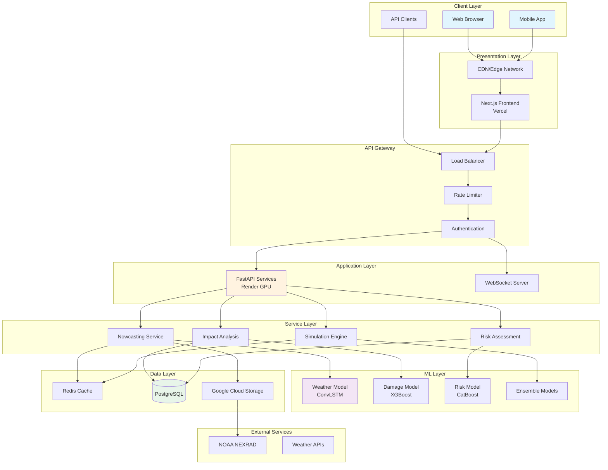

### Microservices Architecture

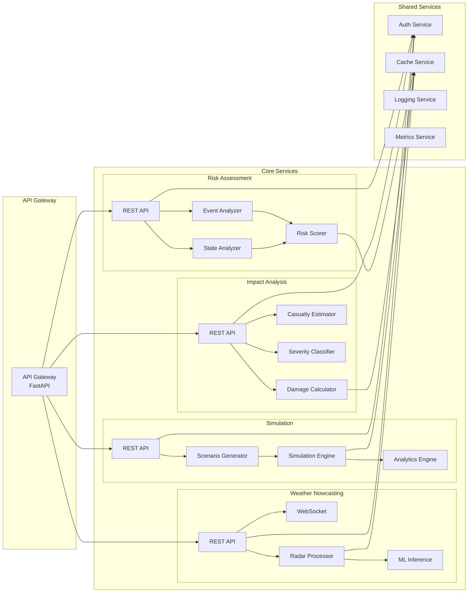

## User Flow Diagrams

### Weather Prediction User Flow

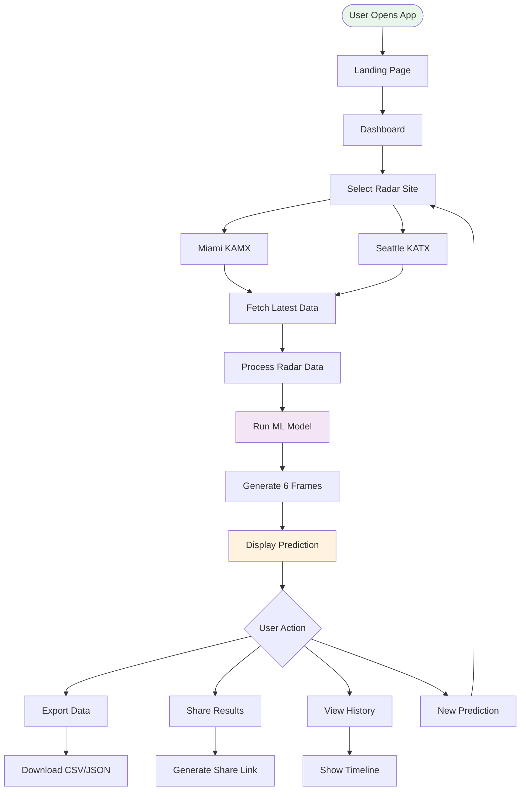

### Impact Analysis Workflow

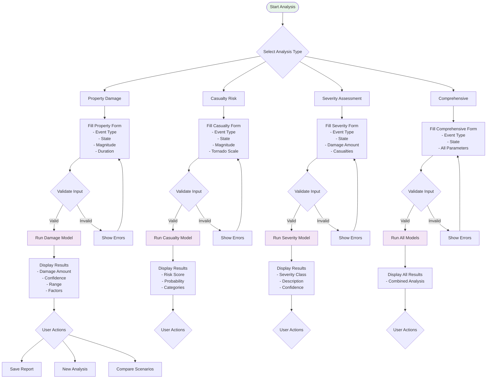

## Data Flow Diagrams

### NEXRAD Data Processing Pipeline

```mermaid
graph LR
    subgraph "Data Source"
        NOAA[NOAA NEXRAD<br/>Level-II Archive]
    end
    
    subgraph "Data Acquisition"
        GCS[Google Cloud Storage<br/>Public Dataset]
        Download[Download Service]
        LocalCache[Local File Cache]
    end
    
    subgraph "Data Processing"
        Parser[PyART Parser]
        QC[Quality Control<br/>- Remove noise<br/>- Filter outliers]
        Interpolation[Grid Interpolation<br/>- Polar to Cartesian<br/>- 64x64 grid]
        Normalization[Normalization<br/>- Scale 0-1<br/>- Handle NaN]
    end
    
    subgraph "ML Pipeline"
        SequenceBuilder[Sequence Builder<br/>10 frames]
        TensorFormat[Tensor Formatting<br/>(1,10,64,64,1)]
        Model[ConvLSTM Model]
        Prediction[6-Frame Prediction]
    end
    
    subgraph "Post-Processing"
        GeoProjection[Geographic Projection]
        Visualization[Visualization Layer]
        API[API Response]
    end
    
    NOAA --> GCS
    GCS --> Download
    Download --> LocalCache
    LocalCache --> Parser
    Parser --> QC
    QC --> Interpolation
    Interpolation --> Normalization
    Normalization --> SequenceBuilder
    SequenceBuilder --> TensorFormat
    TensorFormat --> Model
    Model --> Prediction
    Prediction --> GeoProjection
    GeoProjection --> Visualization
    Visualization --> API
    
    style NOAA fill:#e3f2fd
    style Model fill:#f3e5f5
    style API fill:#e8f5e9
```

### Real-time Data Synchronization

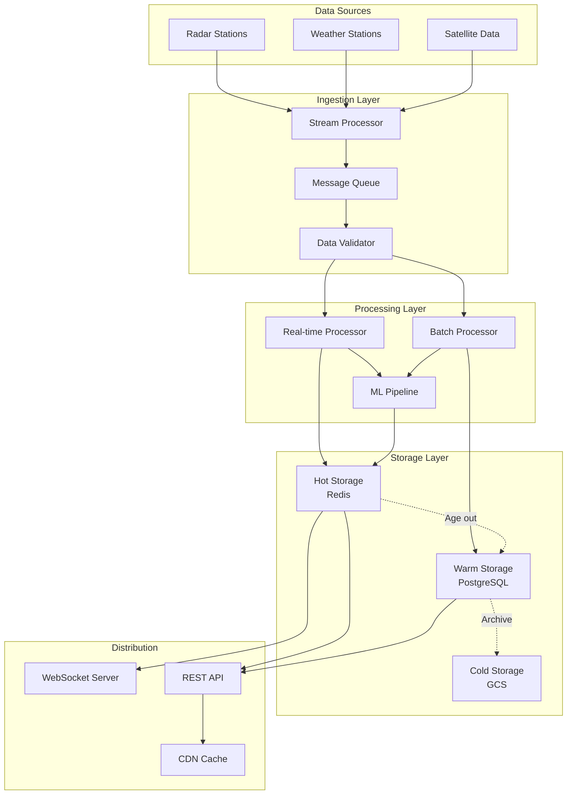

## Component Diagrams

### Frontend Component Hierarchy

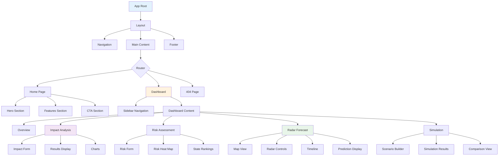

### Backend Service Components

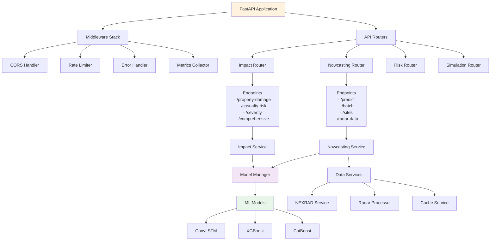

## Deployment Diagrams

### Production Deployment Architecture

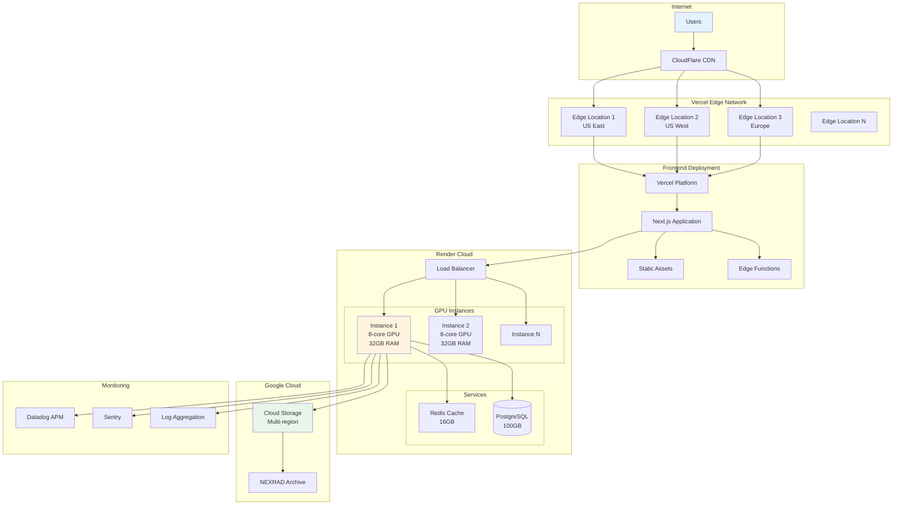

### CI/CD Pipeline

```mermaid
graph LR
    subgraph "Development"
        Dev[Developer]
        LocalEnv[Local Environment]
    end
    
    subgraph "Version Control"
        GitHub[GitHub Repository]
        PR[Pull Request]
        Review[Code Review]
    end
    
    subgraph "CI Pipeline"
        Actions[GitHub Actions]
        Lint[Linting]
        TypeCheck[Type Checking]
        UnitTests[Unit Tests]
        IntTests[Integration Tests]
        Build[Build]
    end
    
    subgraph "CD Pipeline"
        Deploy{Deploy Decision}
        Staging[Staging Deploy]
        StagingTests[Staging Tests]
        Production[Production Deploy]
        Rollback[Rollback]
    end
    
    subgraph "Monitoring"
        HealthCheck[Health Checks]
        Metrics[Metrics]
        Alerts[Alerts]
    end
    
    Dev --> LocalEnv
    LocalEnv --> GitHub
    GitHub --> PR
    PR --> Review
    
    Review --> Actions
    Actions --> Lint
    Lint --> TypeCheck
    TypeCheck --> UnitTests
    UnitTests --> IntTests
    IntTests --> Build
    
    Build --> Deploy
    Deploy -->|main branch| Staging
    Deploy -->|tag| Production
    
    Staging --> StagingTests
    StagingTests -->|Pass| Production
    StagingTests -->|Fail| Rollback
    
    Production --> HealthCheck
    HealthCheck --> Metrics
    Metrics --> Alerts
    
    style Dev fill:#e3f2fd
    style Actions fill:#fff3e0
    style Production fill:#e8f5e9
```

## Sequence Diagrams

### Weather Prediction Sequence

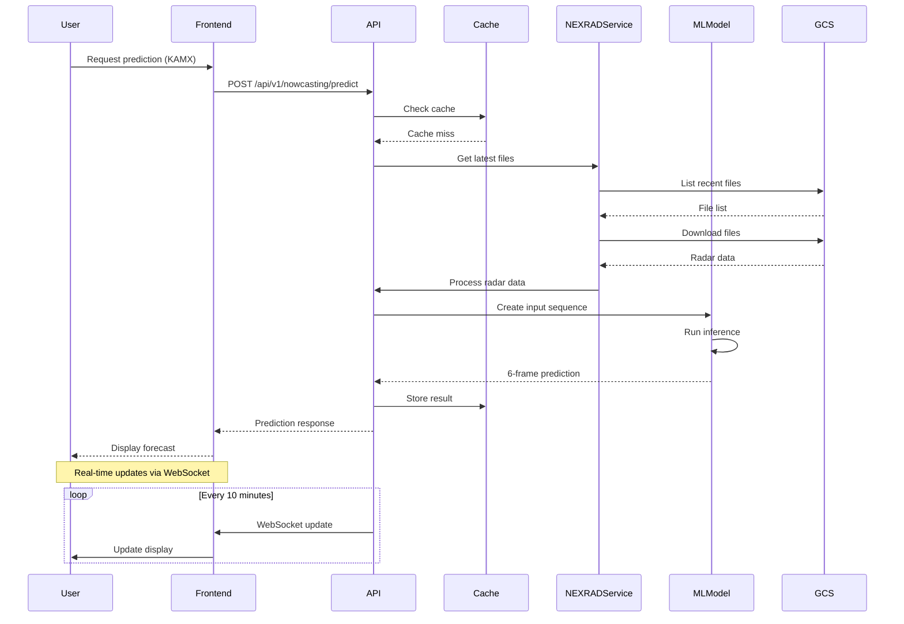

### Impact Analysis Sequence

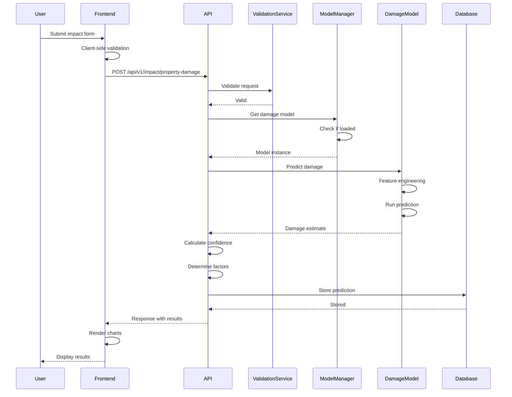

## State Diagrams

### Application State Machine

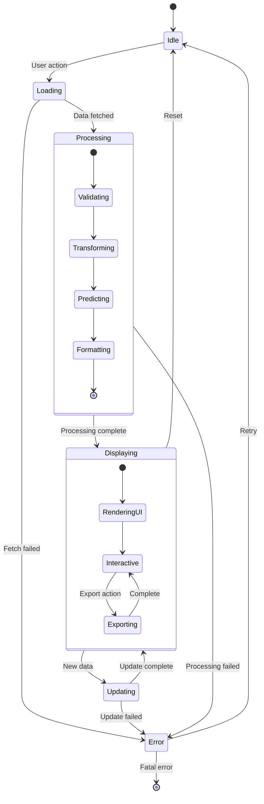

### Model Lifecycle State

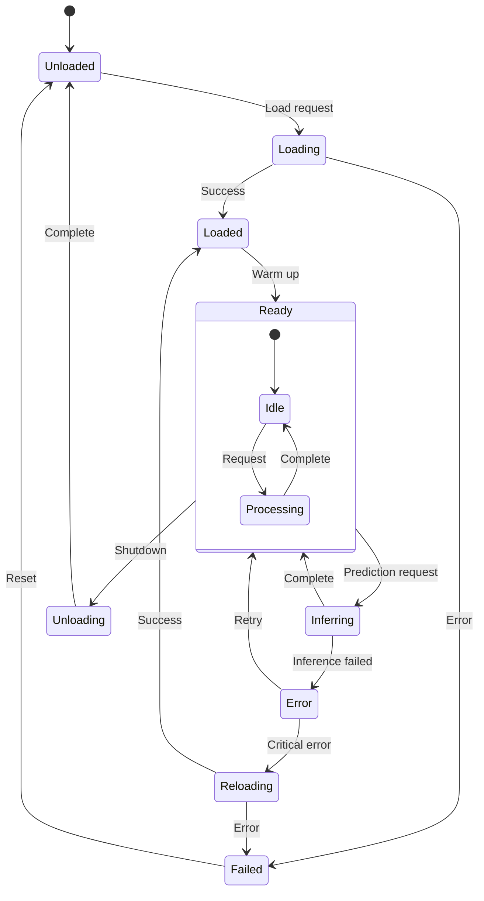

## Infrastructure Diagrams

### Network Architecture

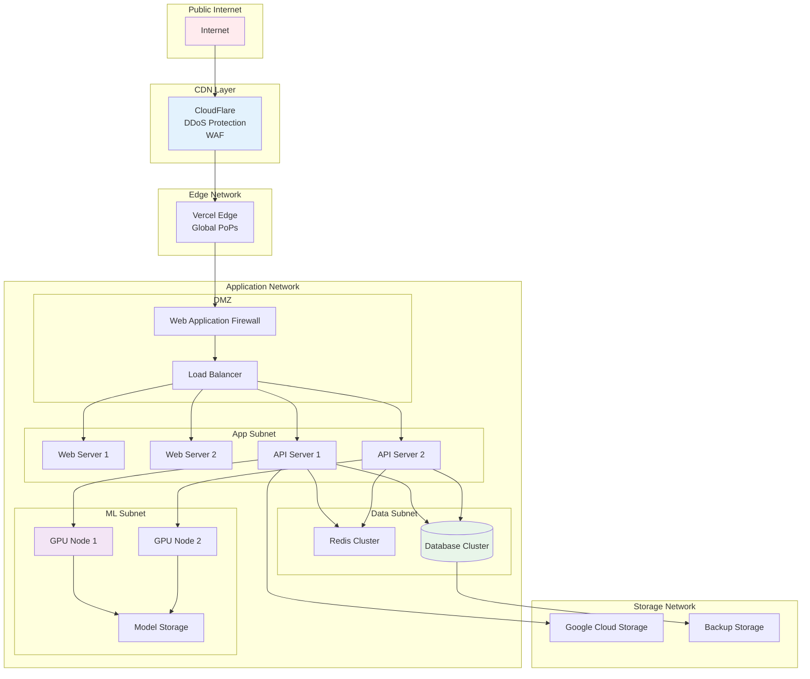

### Resource Allocation

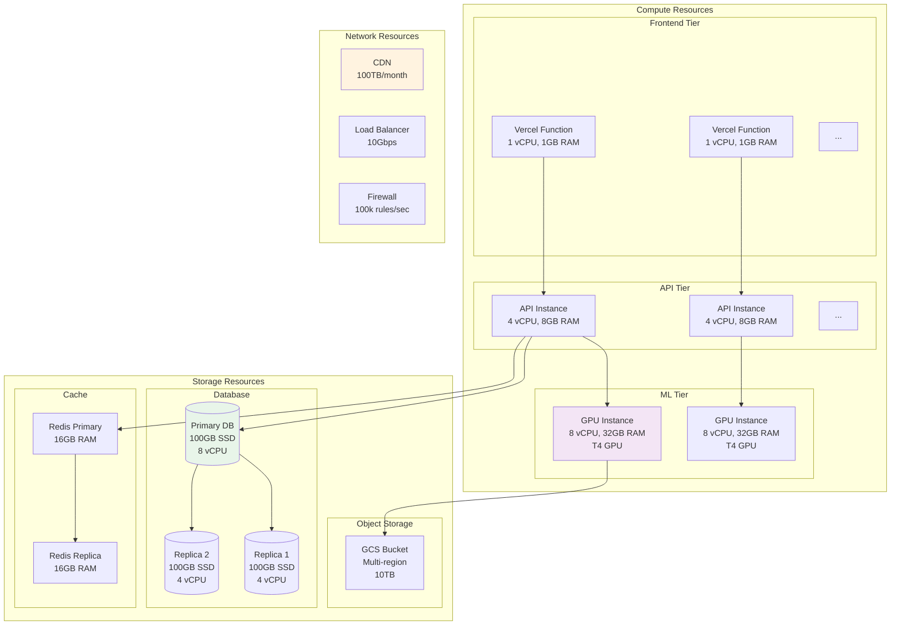

---

*Document Version: 1.0*  
*Last Updated: 2025*  
*Status: Production Ready*

*Note: All diagrams are rendered using Mermaid.js and can be viewed in any Markdown viewer that supports Mermaid syntax.*